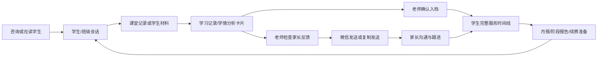

# 学脉完整产品功能结构

> 本文档是学脉的产品功能总地图，用于统一产品范围、页面设计和版本排期。它描述“产品最终需要具备哪些能力”，不代表所有功能同时进入首版开发。

## 一、文档信息

| 项目 | 内容 |
|---|---|
| 文档版本 | V1.1.0 |
| 日期 | 2026-08-06 |
| 产品版本 | 个人版、机构版 |
| 产品形态 | 微信式 AI 教学服务工作台 |
| 当前基线 | `docs/PRD.md` |

本功能总图按 `docs/产品本体与产品形态.md` 的上位模型组织：学生、关系、事件、证据、结论产物和责任承诺是稳定本体；页面和功能是对这些本体的观察与操作方式。

### 1. 优先级说明

| 优先级 | 含义 |
|---|---|
| P0 | 核心闭环，没有它就无法形成产品价值 |
| P1 | 完整日常服务与机构协作能力，核心闭环验证后进入 |
| P2 | 规模化效率、外部数据衔接和增强能力 |
| 暂不做 | 已识别为伪需求、边界外能力或当前不值得自建的模块 |

### 2. 产品版本

| 版本 | 适用对象 | 产品特点 |
|---|---|---|
| 个人版 | 独立老师、个人名师、单账号工作室 | 一个人完成学生、班级、反馈、家长沟通和长期档案管理 |
| 机构版 | 多人共同服务学生的教培机构 | 在个人版核心能力上增加成员、角色、分配、交接、机构总览和批量管理 |

不设置工作室版和集团版。

## 二、产品总逻辑

### 1. 核心产品闭环



### 2. 招生到服务的完整主线

```text
新咨询
→ 记录家长与学生需求
→ 新生测评或试听
→ 生成测评反馈
→ 记录家长决定
→ 报名后转为正式学生
→ 分班和分配负责人
→ 课堂记录与学生材料分析
→ 家长反馈和持续沟通
→ 学生长期档案与阶段报告
→ 服务即将结束提醒
→ 基于真实服务记录进行续费沟通
→ 续费继续服务 / 结束并归档
```

### 3. 产品基本规则

- 学生是所有数据和服务记录的主线。
- 班级承载公共课堂事实，个体结论仍归到具体学生。
- 聊天是日常工作入口，不把老师赶进复杂表单。
- AI 结果先形成可检查的卡片，不能直接成为正式事实。
- 家长反馈必须由老师确认最终内容后发送。
- 学生长期档案必须由老师确认后写入。
- 总览负责发现异常，待处理负责集中处理，批量管理负责提高效率。
- 所有个性化结果按学生独立保留，批量生成不等于批量确认。
- 没有学生作答、订正、批改、笔记或练习痕迹，不判断学生能力。

## 三、页面与导航结构

### 1. 一级入口

| 一级入口 | 核心职责 | 个人版 | 机构版 |
|---|---|---|---|
| 工作台 | 看整体状态、未完成责任、异常和下一步 | 个人范围 | 个人范围、团队范围、机构范围 |
| 会话 | 记录课堂、上传材料、接收家长消息、处理结果卡片 | 支持 | 支持 |
| 学生 | 搜索学生、查看状态和完整服务时间线 | 支持 | 支持 |
| 班级 | 查看班级成员、公共记录和逐学生反馈 | 支持 | 支持 |
| 管理 | 管理偏好、微信、数据来源、成员角色和规模化操作 | 个人设置和个人范围批量操作 | 机构成员、权限、分配、交接和批量操作 |

其中：

- 原“总览”和“待处理”合并为工作台，一个页面同时回答“整体是否正常”和“下一步处理什么”。
- 批量管理不是独立业务入口，而是学生、班级、工作台清单和管理页中的多选操作模式。
- 新生、续费、测评和报告属于学生生命周期中的阶段、事件或产物，不建立并列一级入口。

### 2. 二级详情页

| 页面 | 主要内容 |
|---|---|
| 学生详情页 | 学生状态、家长关系、服务周期、近期关注、最近记录、完整服务时间线 |
| 班级详情页 | 班级信息、成员、负责老师、公共记录、逐学生反馈状态 |
| 分析详情页 | 一次学生材料分析的完整反馈、依据、薄弱点、错误模式和近期方向 |
| 学情报告详情页 | 阶段学情变化、能力表现、重点问题、巩固方向和家长反馈 |
| 月报详情页 | 本月记录、变化、当前关注、下月沟通重点和微信摘要 |
| 历史反馈详情页 | 反馈来源、最终发送内容、发送人、时间和状态 |
| 历史沟通详情页 | 家长原话、事实核对、最终回复、负责人、跟进和处理结果 |
| 新生测评详情页 | 测评材料、优势、薄弱点、依据、家长反馈和报名衔接 |
| 批量结果详情页 | 成功、失败、跳过和每个对象的独立处理结果 |
| 数据接入详情页 | 数据来源、覆盖范围、最近更新、冲突和待确认事项 |

### 3. 卡片和轻量操作层

| 类型 | 作用 |
|---|---|
| 学习记录卡片 | 承载一次课堂或学习过程的结构化记录 |
| 学情分析卡片 | 承载一次学生材料分析的核心结论 |
| 错题分析卡片 | 承载错题、错因依据和相关薄弱点 |
| 微信反馈卡片 | 承载老师可编辑、可发送的家长反馈 |
| 课堂反馈卡片 | 承载班级公共事实和逐学生个体反馈 |
| 月报草稿卡 | 承载学生月度总结草稿 |
| 家长消息处理卡 | 承载事实、待核实项、回复草稿和跟进建议 |
| 服务提醒卡 | 承载服务即将结束、课次不足或长期未记录等提醒 |

## 四、完整功能总表

| 编号 | 功能模块 | 解决的问题 | 主要入口 | 优先级 |
|---|---|---|---|---|
| F01 | 账号、版本与初始化 | 让个人和机构快速建立工作空间 | 登录、管理 | P1 |
| F02 | 总览 | 快速看见整体状态、异常和下一步 | 工作台 | P1 |
| F03 | 微信式聊天工作台 | 让老师在一个入口完成日常教学服务 | 会话 | P0 |
| F04 | 学生、家长与关系管理 | 围绕同一学生组织所有信息 | 学生、学生详情 | P0 |
| F05 | 班级管理 | 管理小班课公共记录和学生差异 | 班级、班级详情 | P0 |
| F06 | 课堂与教学记录 | 低成本记录真实课堂过程 | 聊天、班级会话 | P0 |
| F07 | 学生学习材料管理 | 统一收集学生作业、试卷和错题材料 | 聊天、学生详情 | P0 |
| F08 | 学生材料分析 | 从真实材料形成有依据的学情反馈 | 聊天、分析详情 | P0 |
| F09 | 结果卡片与详情 | 让 AI 输出可检查、可追踪、可处理 | 聊天、详情页 | P0 |
| F10 | 家长反馈与微信发送 | 减少反馈组织时间并保留最终结果 | 微信反馈卡片 | P0/P1 |
| F11 | 家长消息与沟通跟进 | 连接家长原话、教学事实和实际回复 | 会话、工作台 | P1 |
| F12 | 确认入档与完整服务时间线 | 形成可信、连续的学生长期档案 | 卡片、学生详情 | P0 |
| F13 | 月报与阶段报告 | 复用已确认记录展示长期服务价值 | 学生详情、报告详情 | P1 |
| F14 | 待处理与提醒 | 防止反馈、回复、核实和跟进遗漏 | 工作台 | P1 |
| F15 | 新生咨询、测评与转正式学生 | 打通咨询、测评、试听和正式服务 | 学生、新生测评详情 | P1 |
| F16 | 服务周期与续费准备 | 看见服务即将结束并基于事实沟通 | 工作台、学生详情 | P1 |
| F17 | 总体筛选与批量管理 | 降低多学生、多班级重复操作 | 对象列表、管理 | P1 |
| F18 | 机构成员与协作 | 让多人围绕同一学生协作和交接 | 管理、工作台 | P1 |
| F19 | 数据接入、导入与衔接 | 让已有软件数据进入同一学生主线 | 管理、数据接入详情 | P2 |
| F20 | 搜索、通知与个人偏好 | 提高寻找、提醒和日常使用效率 | 全局、管理 | P1/P2 |

## 五、完整功能树

### F01 账号、版本与初始化

#### 个人版

- 手机号或微信登录。
- 创建个人工作空间。
- 设置常教学段、学科和反馈语气。
- 创建第一位学生或导入学生名单。
- 连接家长微信沟通渠道。
- 新手示例：记录一次课堂、上传一份学生材料、生成一次反馈。

#### 机构版

- 创建机构工作空间。
- 设置机构名称和基本服务范围。
- 添加成员并分配角色。
- 导入学生、班级和服务关系。
- 设置默认负责人和交接规则。

#### 产品规则

- 单账号工作室进入个人版，多账号协作进入机构版。
- 初始化只保留完成首个核心闭环所需内容，不做复杂配置向导。

### F02 总览

#### 个人总览

- 学生总数、服务中学生和近期新增学生。
- 今日课程和最近课堂。
- 待反馈、待回复、待核实、待跟进和已逾期。
- 本月已记录学生、可生成月报学生和长期未记录学生。
- 服务即将结束或剩余课次不足的学生。
- 高优先级家长问题。
- 从每个数字、异常或提醒进入对应清单。

#### 机构总览

- 在读学生、班级、服务成员和新生状态分布。
- 今日课堂与教学记录完成情况。
- 待反馈、待回复、待跟进和逾期事项分布。
- 家长高优先级问题和当前负责人。
- 无人负责学生、成员待交接和超期未处理事项。
- 月报、阶段报告和家长反馈完成情况。
- 待测评、待决定、已报名和未报名新生概览。
- 服务即将结束、课次不足和续费沟通准备情况。

#### 产品规则

- 异常和下一步优先于普通数字。
- 每个数据都能进入具体对象或待处理事项。
- 不以聊天数、在线时长和 AI 使用次数评价老师。
- 营收、续费率仅在数据完整可靠时作为辅助信息，不作为当前核心看板。

### F03 微信式聊天工作台

- 学生会话、班级会话和家长消息统一进入会话列表。
- 搜索学生、班级和家长。
- 置顶、未读、待处理和最近会话。
- 输入课堂文字、补充事实和反馈要求。
- 上传学生作业、试卷、错题、笔记和练习记录。
- 在聊天流中接收各种结果卡片。
- 从卡片进入分析、编辑反馈、发送和确认入档。
- 右侧或下一级页面展示学生状态与完整详情。
- 会话中保留来源、时间、处理人和状态。

不在会话页展示完整长报告，也不把会话做成无边界的通用机器人。

### F04 学生、家长与关系管理

#### 学生列表

- 创建、搜索和筛选学生。
- 按新生、试听、服务中、暂停、即将结束、已结束和已归档筛选。
- 展示年级、学科、班级、负责老师、家长关系和服务状态。
- 展示待反馈、待回复、待跟进等当前主状态。
- 支持发现疑似重复学生并合并确认。

#### 学生详情

- 基础信息：姓名、年级、学校、学科。
- 家长关系：家长身份、联系方式、微信绑定和沟通偏好。
- 服务关系：班级、授课老师、班主任、课程顾问。
- 服务周期：试听、服务中、暂停、即将结束、已结束。
- 服务背景：开始日期、结束日期、剩余课次和服务项目。
- 当前学习状态、近期关注点和高频薄弱点。
- 最近课堂、材料分析、反馈和家长沟通。
- 完整服务时间线。
- 最近月报和阶段报告。

#### 产品规则

- 学生详情以查看状态为主，不堆上传、审核和复杂任务按钮。
- 一次表现和一次家长情绪不能变成永久标签。
- 学生与家长可以是一对多或多对一关系，沟通记录必须对应到实际家长。

### F05 班级管理

- 创建班级并设置名称、学段、学科和服务状态。
- 添加或移除学生。
- 设置授课老师、助教和班主任。
- 查看班级成员和个人反馈状态。
- 记录班级公共课堂内容。
- 为个别学生补充差异表现。
- 生成逐学生独立反馈草稿。
- 查看本班待反馈、待补充和长期未记录学生。
- 班级结束时处理未完成反馈和学生去向。

班级公共事实只能作为共同课堂背景，不能自动视为每位学生的个体表现。

### F06 课堂与教学记录

- 记录课堂日期、课程内容和学习目标。
- 记录学生课堂表现、完成情况和需要关注的事实。
- 关联学生、班级、学科和记录人。
- 从简短输入生成学习记录卡片。
- 对信息不足的记录提示补充。
- 编辑、确认和撤回未发送记录。
- 将确认内容用于家长反馈、学生时间线和月报。
- 班课先记录公共内容，再补充个体差异。

### F07 学生学习材料管理

- 上传作业照片、试卷、错题照片、错题本、笔记和练习记录。
- 选择材料对应学生、学科、时间和材料类型。
- 支持一次上传多张材料并查看处理状态。
- 查看原始材料和来源说明。
- 发现材料模糊、缺页、重复或混入其他学生时提示处理。
- 区分有学生痕迹材料和空白/纯教学材料。
- 将同一次学习活动的多份材料归为一组。
- 支持历史材料检索和重新查看分析结果。

### F08 学生材料分析

- 先判断材料是否具备分析条件。
- 识别题目、学生作答、订正和老师批改等可见内容。
- 生成完成情况、优势、薄弱点和错误模式反馈。
- 展示知识薄弱点、难度层表现、学习策略表现和学科能力反馈。
- 展示重点错题成因和可核对依据。
- 形成优先关注点、复发风险和近期巩固方向。
- 生成老师版完整分析和家长微信版摘要。
- 信息不足时只描述可见事实，并提示补充材料。
- 老师可修正结果并保留更正记录。

不承诺提分，不根据空白材料推断能力，不用一次材料生成长期负面结论。

### F09 结果卡片与详情

- 每次正式结果以卡片出现在对应会话中。
- 卡片显示结果类型、来源、生成时间、当前状态和核心摘要。
- 卡片操作包括查看详情、编辑反馈、确认发送和确认入档。
- 分析详情展示完整报告，会话页只保留摘要。
- 展示材料来源和注意事项。
- 支持结果更正、失效和重新生成。
- 异常状态包括证据不足、需补充材料和分析失败。
- 正式卡片与普通聊天回复明显区分。

### F10 家长反馈与微信发送

- 从课堂记录、材料分析、月报和测评生成反馈草稿。
- 反馈正文使用家长容易理解的语言。
- 老师可编辑、换一版、复制和保存草稿。
- 发送前确认家长、学生和最终内容。
- 微信已连接时由老师主动点击发送。
- 微信未连接时复制发送并手工标记已发。
- 保存最终采用版本、发送人、发送时间和结果。
- 发送失败时保留草稿，不误标为已反馈。
- 过度承诺、侮辱性表达和无依据结论必须提醒修改。

核心状态：待反馈、已反馈；入档状态作为次级信息展示。

### F11 家长消息与沟通跟进

- 家长微信消息进入对应学生会话。
- 无法匹配时进入消息认领。
- 区分家长原话、已知事实、待核实信息和建议回复。
- 识别日常、试听、效果疑问、投诉、退费、续费等沟通场景。
- 结合已确认的课堂和学习记录生成回复草稿。
- 老师补充事实、编辑并确认回复。
- 需要继续处理时设置负责人和计划时间。
- 电话、面谈和线下沟通可手工记录到同一时间线。
- 同一事件的多次沟通合并查看。
- 保存实际回复和最终处理结果。

投诉、退费、安全和严重服务争议进入高优先级处理，不允许普通批量关闭。

### F12 确认入档与完整服务时间线

#### 确认入档

- AI 结果默认是草稿或待入档候选。
- 老师选择需要长期保留的结论。
- 显示内容来源和影响范围。
- 确认后写入学生长期记录。
- 支持更正，不静默覆盖原记录。

#### 完整服务时间线

- 首次咨询。
- 新生测评和试听。
- 报名与转正式学生。
- 进入班级和负责人变化。
- 课堂记录。
- 作业、试卷和错题分析。
- 家长反馈及发送结果。
- 家长微信、电话和面谈沟通。
- 跟进事项和处理结果。
- 月报和阶段报告。
- 服务暂停、恢复、即将结束、续费或结束。

时间线明确区分原始记录、AI 草稿、老师确认结果和家长实际收到内容。

### F13 月报与阶段报告

- 使用已经确认的课堂、材料分析、反馈和沟通记录生成报告草稿。
- 月报包含本月内容、主要表现、已确认变化、当前关注点和近期方向。
- 阶段报告包含成绩或完成情况、能力维度、错误模式、知识薄弱点和重点成因。
- 展示本期依据和数据可信度。
- 有可比较历史时展示变化；没有历史时不制造“明显进步”。
- 生成老师完整版和家长微信摘要。
- 老师编辑、确认发送并保存最终版本。
- 批量生成时每位学生保留独立草稿。
- 记录不足时生成简版或明确提示无法生成。

### F14 待处理与提醒

- 待反馈。
- 待回复。
- 待核实。
- 待跟进。
- 待入档。
- 已逾期。
- 高优先级家长问题。
- 服务即将结束或剩余课次不足。
- 长期没有课堂记录或家长反馈。
- 新生待测评、待决定和待转正式学生。
- 机构学生无人负责和成员待交接。

每个待处理事项必须能回到对应学生、会话或详情页完成处理；产品不扩展为通用项目管理工具。

### F15 新生咨询、测评与转正式学生

- 创建新生并绑定家长。
- 记录咨询来源、学习需求、年级、学科和已知情况。
- 分配课程顾问或负责人。
- 记录试听安排和试听结果。
- 上传新生测评材料。
- 生成新生测评分析和家长反馈。
- 记录家长沟通、待确认事项和最终决定。
- 报名后转为正式学生，保留全部历史。
- 未报名学生保留为历史新生，不混入在读学生。
- 发现重复学生时合并到已有主线。

不做营销群发、自动销售话术轰炸和确定性报名预测。

### F16 服务周期与续费准备

#### 服务周期

- 服务项目、开始日期、结束日期和剩余课次。
- 服务中、暂停、即将结束、已结束等状态。
- 服务负责人和当前班级。
- 服务暂停、恢复和结束原因。

#### 续费准备

- 服务即将结束或课次不足提醒。
- 汇总近期课堂、反馈、报告和家长沟通情况。
- 提示尚未完成的反馈、报告和跟进。
- 生成基于真实服务事实的沟通准备摘要。
- 记录实际续费沟通、家长决定和后续安排。
- 续费后延续同一学生档案，不重新建档。

不预测“必然续费/必然流失”，不将营收看板作为教学服务工作的核心入口。

### F17 总体筛选与批量管理

#### 支持对象

- 学生。
- 班级。
- 课堂记录。
- 家长反馈。
- 月报。
- 跟进事项。
- 新生。
- 机构成员交接事项。

#### 支持操作

- 批量加入或调整班级。
- 批量分配授课老师、班主任、课程顾问或跟进负责人。
- 批量调整服务状态和计划完成时间。
- 批量生成逐学生反馈草稿、月报草稿和普通跟进事项。
- 批量进入检查队列。
- 批量归档已结束且无未完成事项的学生。
- 查看批量处理进度、成功、失败和跳过明细。

#### 禁止操作

- 未检查直接批量发送个性化反馈。
- 批量确认学生长期档案。
- 批量关闭投诉、退费和安全类事项。
- 批量归档仍有待反馈、待回复或待跟进的学生。
- 将同一份个性化结论覆盖到所有学生。

### F18 机构成员与协作

- 成员邀请、停用和离开。
- 机构负责人、教务/管理员、授课老师、助教、班主任和课程顾问角色。
- 分配学生、班级和服务事项。
- 按角色和负责范围查看内容。
- 反馈、沟通、入档和跟进显示实际处理人。
- 多人同时处理同一事项时显示占用状态。
- 成员离开前查看未完成事项并完成交接。
- 机构负责人查看整体服务状态和异常，不默认查看所有聊天原文。
- 教务集中处理分班、负责人和普通服务状态。
- 负责人可查看超期、无人负责和高优先级事项。

不做总部—区域—校区多层治理，不做工资、人事绩效和在线时长考核。

### F19 数据接入、导入与衔接

#### 数据接入中心

- 查看已经连接的数据来源和覆盖内容。
- 查看学生、班级、课程、课次、出勤、服务周期、家长关系和沟通等可用信息。
- 展示最近更新时间、当前状态和待处理问题。
- 支持暂停、恢复或解除某个来源。
- 每条外部记录都能看到来源。

#### 首次导入与历史迁移

- 导入学生名单、班级关系和负责人。
- 导入服务状态、开始/结束日期和剩余课次。
- 导入历史课堂、反馈和家长沟通摘要。
- 导入前预览，完成后展示成功、失败和未识别内容。
- 发现重复学生、冲突关系或无法匹配家长时人工确认。

#### 产品边界

- 数据打通的目标是让学生服务主线连续，不是把所有外部系统完整搬进学脉。
- 排课、考勤、收费和支付信息只保留教学服务所需状态和来源。
- 不自建复杂排课、完整收费会计、发票、工资、人事和营销自动化系统。
- 外部数据中断时保留已有历史，并明确提示当前可能不是最新状态。

### F20 搜索、通知与个人偏好

#### 全局搜索

- 搜索学生、班级、家长、课堂记录、材料、报告和沟通。
- 支持按时间、学科、状态、负责人和来源筛选。
- 搜索结果直接进入对应会话或详情。

#### 通知

- 新家长消息。
- 待反馈、待回复和待跟进。
- 高优先级沟通。
- 服务即将结束和剩余课次不足。
- 批量操作完成或部分失败。
- 机构分配、权限变化和交接提醒。

#### 个人偏好

- 常教学段和学科。
- 反馈语气、长度和常用结构。
- 常用筛选和总览范围。
- 通知开关和免打扰时间。
- 默认查看个人范围或机构范围。

## 六、个人版与机构版能力矩阵

| 能力 | 个人版 | 机构版 |
|---|---|---|
| 学生/班级聊天 | 全部自己的学生和班级 | 被分配范围 |
| 课堂记录和材料分析 | 支持 | 支持 |
| 微信反馈和家长沟通 | 支持 | 支持并记录实际处理人 |
| 学生档案、时间线和报告 | 支持 | 支持并按角色查看 |
| 个人总览 | 支持 | 每位成员支持 |
| 机构总览 | 不提供 | 负责人和授权成员支持 |
| 待处理 | 个人事项 | 个人事项、团队事项和机构异常 |
| 批量管理 | 个人范围 | 权限范围、团队分工和交接 |
| 新生测评与转正式学生 | 支持 | 支持课程顾问与老师协作 |
| 服务周期和续费准备 | 支持 | 支持负责人分工与总体查看 |
| 成员、角色和权限 | 不提供 | 支持 |
| 学生分配和成员交接 | 不提供 | 支持 |
| 数据接入和导入 | 个人数据 | 机构数据和负责人范围 |

## 七、统一状态结构

### 1. 学生身份阶段

```text
新咨询 → 待测评/待试听 → 待决定 → 已报名 → 正式学生
                                      ↘ 未报名 → 历史新生
```

### 2. 服务状态

```text
未开始 → 服务中 → 暂停 → 服务中 → 即将结束 → 已结束 → 已归档
```

### 3. 反馈与入档状态

| 类型 | 状态 |
|---|---|
| 反馈 | 待反馈、已反馈 |
| 入档 | 待入档、已入档 |
| 异常 | 证据不足、需补充材料、分析失败 |

展示优先级：已反馈 > 待反馈 > 已入档 > 待入档。

### 4. 家长沟通状态

```text
待认领 → 待核实 → 待回复 → 已回复 → 待跟进 → 已完成
```

投诉、退费、安全和严重服务争议额外显示高优先级。

### 5. 批量处理状态

```text
未选择 → 已选择 → 待确认 → 处理中 → 全部完成/部分完成/失败/已取消
```

## 八、阶段功能边界

### 第一阶段：P0 核心闭环

- 学生与班级。
- 微信式聊天入口。
- 课堂记录。
- 学生材料上传和分析。
- 学习记录卡片、学情分析卡片和分析详情页。
- 家长反馈草稿、编辑、复制和标记已发。
- 老师确认入档。
- 学生详情和基础时间线。

完成标志：老师可以从一次真实课堂或学生材料开始，完成分析、家长反馈和长期档案沉淀。

### 第二阶段：P1 完整日常服务

- 微信消息接收和老师确认发送。
- 家长消息分析、回复和跟进。
- 月报、阶段报告和班级逐学生反馈。
- 个人总览、待处理和批量管理。
- 新生测评与正式学生衔接。
- 服务周期和续费准备。
- 机构成员、角色、分配和交接。
- 机构总览和服务异常。

完成标志：个人老师和机构都能在学脉内完成招生衔接、教学服务、家长沟通和阶段总结。

### 第三阶段：P2 数据衔接与规模化

- 数据接入中心。
- 学生、班级、服务周期和历史记录导入。
- 课程、课次、出勤和服务状态作为教学服务背景进入学生主线。
- 数据冲突、重复学生和无法匹配记录的确认处理。
- 更完整的跨学生、跨班级搜索筛选。
- 总览趋势、服务覆盖和异常复盘。

完成标志：机构无需重复录入核心学生服务数据，外部信息能够回到同一学生主线持续复用。

## 九、明确不做的功能

| 不做功能 | 原因 |
|---|---|
| 老师备课、教案和课件生成 | 不属于当前学生服务闭环 |
| 面向学生的开放式答题助手 | 产品主要服务老师和机构 |
| 每日打卡、学生任务派发中心 | 增加管理负担，且需要另一套学生端闭环 |
| 完整题库和全自动批改平台 | 范围过大，削弱材料分析和反馈主线 |
| 复杂排课系统 | 只需要课程事实和服务状态，不重复建设教务 ERP |
| 完整收费、会计、发票和支付系统 | 只保留服务所需状态和记录 |
| 工资、人事和绩效系统 | 不属于教学服务连续性 |
| 自动营销和批量骚扰消息 | 破坏家长信任并扩大合规风险 |
| 自动回复家长 | AI 只能生成草稿，发送权属于老师 |
| 永久学生或家长负面标签 | 一次事件不能固化为人格判断 |
| 保证提分、保证报名或保证续费 | 缺少可靠依据且属于过度承诺 |
| 多层集团治理和复杂校区驾驶舱 | 当前只做个人版和机构版 |
| 装饰性 AI 评分和无依据雷达图 | 数字必须有真实来源和可解释依据 |

## 十、产品结构验收标准

- 每个核心功能都能映射到明确页面入口和结果位置。
- 同一学生从咨询、测评到正式服务不需要重新建档。
- 同一条课堂或学生材料记录能够被反馈、档案、月报或沟通复用。
- 老师可以在聊天入口完成大部分高频记录和反馈工作。
- 机构负责人能够从总览异常直接进入具体学生或事项。
- 批量操作完成后可以查看每个对象的独立结果。
- 未经老师确认的反馈不能显示为已反馈。
- 未经老师确认的结论不能写入学生长期档案。
- 没有学生学习痕迹的材料不能生成能力结论。
- 家长消息、实际回复、负责人、时间和结果可以完整追踪。
- 服务周期只用于提醒和沟通准备，不演变为完整财务后台。
- 外部数据进入学脉后能看到来源、更新时间和异常状态。

## 十一、功能取舍总原则

判断一个新功能是否应该进入学脉，依次回答：

1. 它是否围绕具体学生或班级产生真实教学服务记录？
2. 它是否减少老师重复整理、重复询问或重复录入？
3. 它是否能继续用于家长反馈、学生档案、报告或机构协作？
4. 它是否有明确页面入口、状态、负责人和处理结果？
5. 它是否会跳过老师确认、放大无依据结论或形成自动承诺？
6. 它是否只是财务、人事、排课、营销等通用后台能力？

前四项不能形成明确价值，或触发第五、六项风险的功能，不进入当前产品结构。
