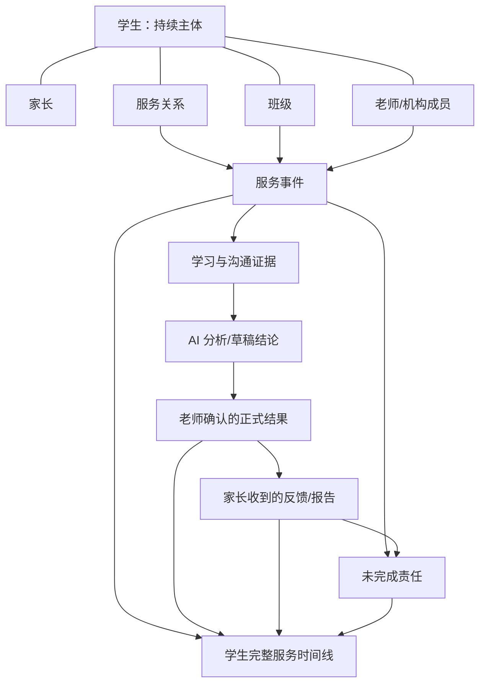

# 学脉产品本体与产品形态

> 本文档从本体论角度回答两个问题：学脉真正管理的“存在物”是什么；这些存在物应该如何组合成稳定、清晰、不会随竞品功能增加而膨胀的产品形态。

## 一、最终结论

学脉不是“教培功能大全”，也不是“给每个教培场景配一个 AI 按钮”。

学脉的本体是：

```text
以学生为持续主体
以服务关系为上下文
以真实事件为时间轴
以学习证据为事实基础
以老师确认的结论为正式记录
以家长沟通和责任完成为服务闭环
```

产品可以压缩成一句话：

> 学脉是一套以学生为中心的教学服务记忆与协作系统，外观像微信，内部沉淀连续、可核对、可协作的学生服务历史。

产品公式：

```text
学脉
= 学生服务主体
+ 服务关系网络
+ 事件时间流
+ 证据与结论分层
+ 老师确认机制
+ 沟通与责任闭环
+ 面向不同角色的视图
```

## 二、为什么不能直接按功能列表设计产品

如果按竞品功能拆分，产品会不断长出：

- 新生管理。
- 学生管理。
- 课堂反馈。
- 作业分析。
- 学情报告。
- 家长沟通。
- 学习规划。
- 待办中心。
- 续费管理。
- 课时管理。
- 考勤管理。
- 数据看板。
- 批量管理。

这些名称看似彼此独立，实际上大量功能在重复使用同一批底层事实：

- 同一个学生。
- 同一个家长。
- 同一次课堂。
- 同一份试卷或作业。
- 同一条老师观察。
- 同一次家长沟通。
- 同一个服务周期。

如果每个功能都建立自己的学生、状态和记录，最终必然出现：

- 新生报名后重新建档。
- 课堂反馈与月报内容不一致。
- 家长沟通看不到老师真实记录。
- 续费沟通只能看课时和金额，看不到服务过程。
- 总览数字无法进入具体事实。
- 同一信息在多个页面重复填写。

所以，产品设计必须先确定“什么东西真实存在”，再决定页面如何观察和操作它们。

## 三、六类核心本体

### O1 学生：持续存在的服务主体

学生不是“在读学生列表中的一行”，也不是“报名后才创建的客户”。

学生从首次咨询开始就持续存在：

```text
新咨询 → 测评/试听 → 待决定 → 正式服务 → 暂停/恢复 → 续费/结束 → 历史保留
```

变化的是学生所处阶段和服务关系，不是学生本人。

因此：

- 新生和在读学生不是两套对象。
- 试听学生和正式学生不能重复建档。
- 续费不是创建新学生，而是延续或新增服务关系。
- 结束服务后，学生历史仍然存在。

产品表达：学生页管理的是所有学生主体，通过阶段和服务状态筛选，而不是拆成互不相通的新生系统、在读系统和历史系统。

### O2 关系：学生与其他对象之间的真实连接

学生不是孤立存在的。教学服务由多种关系构成：

| 关系 | 含义 |
|---|---|
| 学生—家长 | 谁是监护人、谁接收反馈、谁参与沟通 |
| 学生—班级 | 学生在哪个班级接受共同教学服务 |
| 学生—老师 | 谁负责授课和专业判断 |
| 学生—班主任 | 谁负责日常家长沟通和跟进 |
| 学生—课程顾问 | 谁负责咨询、试听、报名和续费沟通 |
| 学生—服务 | 当前接受什么服务、处于什么周期 |
| 成员—机构 | 成员以什么角色服务哪些学生 |

关系有开始、结束和变化时间。

因此：

- 家长不是学生表中的一个电话号码，而是有身份和沟通历史的关系对象。
- 班级不是文件夹，而是一段群体教学关系。
- 负责人不是永久属性，负责人变化必须保留历史。
- 服务周期不是财务账户，而是学生与老师/机构之间的一段服务关系。

### O3 事件：真实发生过的事情

产品中最重要的事实不是静态字段，而是按时间发生的事件。

核心事件包括：

- 创建咨询。
- 参加测评。
- 完成试听。
- 确认报名。
- 加入或离开班级。
- 完成一次课堂。
- 提交一份作业或试卷。
- 发生一次批改或订正。
- 生成一次分析。
- 老师完成一次家长反馈。
- 家长发送一条消息。
- 老师进行一次电话或面谈。
- 创建、完成或逾期一次跟进。
- 服务暂停、恢复、续费或结束。
- 成员分配或交接。

事件具有：

- 发生时间。
- 对应学生或班级。
- 参与人。
- 来源。
- 原始内容。
- 当前处理结果。

产品表达：聊天流和学生时间线，本质上都是对事件的时间顺序呈现。

### O4 证据：可以支持判断的原始材料

证据是结论的依据，但证据本身不是结论。

证据包括：

- 学生作答。
- 学生订正。
- 老师批改。
- 学生笔记。
- 练习记录。
- 课堂中可观察的具体表现。
- 已确认的成绩和完成情况。
- 家长原话。
- 老师最终回复。
- 服务日期、课次和出勤事实。

必须明确区分：

| 内容 | 本体位置 |
|---|---|
| “这道题学生写错了” | 可见事实 |
| “可能没有掌握二次函数分类讨论” | 分析结论 |
| “家长说孩子最近没效果” | 家长原话 |
| “教学没有效果” | 尚未核实的判断 |
| “本次课未完成作业” | 本次事件事实 |
| “学生不认真” | 不应固化的长期定性 |

产品表达：所有正式学情结论都能回到具体证据；证据不足时只能提示补充，不能补造结论。

### O5 结论与服务产物：对事实的解释和对外表达

结论不是原始事实，而是基于证据形成的解释。

服务产物包括：

- 学习记录卡片。
- 学情分析卡片。
- 错题分析卡片。
- 家长反馈草稿。
- 老师确认后的家长反馈。
- 月报。
- 阶段报告。
- 新生测评报告。
- 近期巩固方向。
- 续费沟通准备摘要。

同一份内容至少存在三个层次：

```text
原始事实/证据
→ AI 生成的分析或草稿
→ 老师确认后的正式结论或最终表达
```

必要时还有第四层：

```text
家长实际收到的内容
```

因此：

- AI 草稿不是学生档案。
- 家长反馈不是原始学情事实。
- 月报不是新的真相，而是某个时间范围内已确认记录的组合视图。
- 报告中的变化必须来自可比较的历史证据。
- 老师确认入档和老师确认发送是两个不同动作。

### O6 责任与承诺：还需要有人完成的事情

“待处理”不是独立业务对象，而是一个尚未完成的责任。

责任包括：

- 需要老师完成反馈。
- 需要授课老师补充事实。
- 需要班主任回复家长。
- 需要课程顾问继续跟进。
- 需要负责人处理投诉或退费。
- 需要教务重新分配无人负责学生。
- 需要成员离开前完成交接。
- 需要老师检查批量生成的个性化草稿。

每个责任必须有：

- 对应学生或事件。
- 责任人。
- 产生原因。
- 计划完成时间。
- 优先级。
- 完成结果。

产品表达：工作台中的待处理区不是任务管理软件，而是从服务事件中自动汇总尚未完成的责任。

## 四、辅助本体：状态、来源和视图

### 1. 状态不是独立事实，而是事件与责任的当前投影

例如“待反馈”意味着：

- 已存在可供老师处理的反馈草稿；
- 但还没有发生有效的反馈完成事件。

“即将结束”意味着：

- 当前服务关系有效；
- 且结束时间或剩余课次进入提醒范围。

所以状态应从真实事件、关系和未完成责任中得出，避免不同页面各自维护一套相互矛盾的状态。

### 2. 来源说明事实从哪里来

来源可以是：

- 老师手工记录。
- 学生材料。
- 家长微信消息。
- 机构成员补充。
- 其他教务软件提供的课程、课次或出勤信息。
- 已有历史资料导入。

来源不是新的业务模块。数据接入的作用，是把外部事实归到学脉已有的学生、关系和事件上。

### 3. 页面是视图，不是新的数据孤岛

| 页面/功能 | 本体含义 |
|---|---|
| 聊天 | 事件的日常录入、接收和处理视图 |
| 学生详情 | 围绕一个学生的关系、状态和历史视图 |
| 班级详情 | 围绕一段群体教学关系的视图 |
| 总览 | 多个学生和责任的聚合视图 |
| 待处理 | 未完成责任的筛选视图 |
| 月报 | 已确认事件和结论的周期视图 |
| 学情报告 | 学习证据和结论的专题视图 |
| 续费准备 | 服务关系即将变化时的事实汇总视图 |
| 批量管理 | 对一组对象执行同类动作的操作方式 |

## 五、本体关系图



## 六、将原有需求重新归并

### 1. 新生、学生、续费归为“学生生命周期”

不再把新生管理、学生管理、续费管理理解为三个系统。

它们都是：

```text
同一个学生
+ 不同阶段
+ 不同服务关系状态
+ 不同待完成责任
```

产品归属：学生页、学生详情、工作台提醒。

### 2. 课堂记录、材料分析、AI 测评归为“证据到结论”

它们共享同一条转换链：

```text
真实记录或材料
→ 判断是否有足够证据
→ 生成分析草稿
→ 老师检查
→ 形成反馈或正式档案
```

产品归属：会话页中的工作流卡片和分析详情，不建立多个独立 AI 工具入口。

### 3. 上课反馈、月报、阶段报告归为“服务产物”

区别只在：

- 使用哪些已确认事件。
- 覆盖什么时间范围。
- 面向老师还是家长。
- 是否已经发送。

产品归属：会话卡片、学生详情中的历史产物、报告详情。

### 4. 微信沟通、电话、面谈归为“沟通事件”

渠道不同，但都需要：

- 对应学生和家长。
- 记录原话或沟通摘要。
- 区分事实与待核实内容。
- 保存实际回复或结果。
- 需要时产生后续责任。

产品归属：会话页、学生时间线、工作台待处理。

### 5. 总览、待处理、提醒归为“工作台投影”

三者都在回答同一个问题：

> 现在整体是否正常，我下一步应该处理什么？

因此不需要三个彼此割裂的一级产品。

产品归属：统一工作台，包括状态概览、异常、我的待处理和快捷进入。

### 6. 批量管理归为“操作模式”

批量不是一个业务领域。它只是：

```text
筛选一组同类对象
→ 执行共同允许的动作
→ 每个对象保留独立结果
```

产品归属：学生、班级、工作台清单和管理页中的多选模式；机构版可以提供批量结果中心，但不需要把“批量管理”做成老师每天进入的独立世界。

### 7. 数据接入归为“事实来源”

外部软件不是学脉的新模块。它们只为现有本体补充：

- 学生身份。
- 班级和负责人关系。
- 课堂、课次和出勤事件。
- 服务周期状态。
- 家长沟通或历史记录。

产品归属：管理页中的数据来源与冲突处理。

## 七、由本体重新组合出的产品形态

### 1. 一个核心

唯一核心是“学生服务主线”。

所有内容最终都能回答：

- 这是谁的记录？
- 发生了什么？
- 依据是什么？
- 谁作出了判断？
- 家长实际收到什么？
- 还有谁需要完成什么？
- 这件事如何影响学生当前状态和长期历史？

### 2. 两种工作模式

#### 个人版

一个老师既是记录者、判断者、反馈者和数据所有者。

产品重点：

- 快速记录。
- 快速反馈。
- 学生情况不丢。
- 月报和长期记录自动复用。
- 学生多时仍能看见异常和批量处理普通事项。

#### 机构版

多个成员围绕同一学生承担不同责任。

产品重点：

- 谁负责什么。
- 谁能看到什么。
- 哪些服务已经完成。
- 哪些事项无人处理或已经逾期。
- 成员变化后如何交接。
- 负责人如何看见整体而不要求老师重复填表。

机构版不是另一套产品，而是同一本体上的多人协作模式。

### 3. 五个主页面

本体重组后，建议将原 7 个一级入口收敛为 5 个。

| 主页面 | 本体职责 | 包含能力 |
|---|---|---|
| 工作台 | 聚合当前状态和未完成责任 | 总览、待处理、异常、提醒、今日事项、快捷进入 |
| 会话 | 创建、接收和处理服务事件 | 学生聊天、班级聊天、家长消息、课堂记录、材料上传、结果卡片 |
| 学生 | 查看持续主体的全部关系和历史 | 新生/在读/暂停/结束筛选、学生详情、服务周期、完整时间线、报告 |
| 班级 | 查看群体教学关系和个体差异 | 班级成员、公共课堂记录、逐学生反馈、班级状态 |
| 管理 | 管理规模化规则和来源 | 成员角色、学生分配、批量模式、数据来源、导入迁移、偏好和设置 |

说明：

- “待处理”并入工作台，因为它是未完成责任的视图。
- “批量管理”并入对象列表和管理页，因为它是操作方式，不是业务本体。
- “新生”“续费”“月报”“测评”不成为一级导航，它们是学生生命周期中的阶段、事件或产物。
- AI 功能不单列“AI 工具箱”，而是在会话和详情中以确定工作流出现。

### 4. 三层信息表达

#### 第一层：会话流

回答“刚刚发生了什么、我现在要做什么”。

展示：

- 消息。
- 课堂记录。
- 材料。
- 处理过程。
- 结果卡片。
- 操作入口。

#### 第二层：详情页

回答“这一次结果具体依据什么、完整结论是什么”。

展示：

- 原始来源。
- 证据。
- 分析。
- 风险与局限。
- 家长反馈。
- 入档和发送状态。

#### 第三层：学生主线

回答“这个学生长期发生了什么、现在处于什么状态”。

展示：

- 当前关系。
- 当前状态。
- 已确认记录。
- 完整服务时间线。
- 报告和沟通历史。
- 未完成责任。

### 5. 四条彼此独立的状态线

不能用一个“学生状态”字段承载所有事情。

| 状态线 | 示例 |
|---|---|
| 身份/服务状态 | 新咨询、待测评、正式学生、暂停、即将结束、已结束 |
| 分析结果状态 | 分析中、可处理、证据不足、需补充、分析失败 |
| 反馈与入档状态 | 待反馈、已反馈、待入档、已入档 |
| 沟通与责任状态 | 待认领、待核实、待回复、待跟进、已完成、已逾期 |

页面根据场景选择主状态，不把不同状态互相覆盖。

## 八、五个主页面的具体产品形态

### 1. 工作台

#### 用户进入后先看到

- 今天需要处理什么。
- 哪些学生或家长出现异常。
- 哪些反馈、回复、核实或跟进已经逾期。
- 哪些学生长期没有记录。
- 哪些服务即将结束或剩余课次不足。
- 哪些新生待测评、待决定或待转正式学生。

#### 机构版额外看到

- 无人负责学生。
- 成员待交接。
- 团队服务完成情况。
- 高优先级家长问题和责任人。
- 需要批量分配或处理的普通事项。

工作台不是经营大屏，而是“异常—对象—处理”的入口。

### 2. 会话

#### 左侧/第一层

- 学生会话。
- 班级会话。
- 家长消息。
- 未读、置顶和待处理标记。

#### 中间/主操作区

- 输入课堂事实。
- 上传学生材料。
- 接收家长消息。
- 查看结果卡片。
- 编辑反馈。
- 确认发送。
- 确认入档。

#### 右侧/下一层

- 学生当前状态。
- 最近记录。
- 近期关注点。
- 对应分析详情或沟通详情。

会话是唯一高频工作入口，不增加并列的 AI 工具箱。

### 3. 学生

#### 学生列表

- 全部学生。
- 新咨询/待测评。
- 试听/待决定。
- 正式服务。
- 暂停。
- 即将结束。
- 已结束/已归档。

#### 学生详情

- 基础身份。
- 家长、班级、老师和服务关系。
- 当前服务状态。
- 当前学情状态。
- 近期关注点。
- 最近反馈和沟通。
- 完整服务时间线。
- 月报、阶段报告和测评报告。
- 服务即将变化时的沟通准备。

学生详情以理解状态为主，高频记录和上传仍回到会话。

### 4. 班级

- 班级身份和服务状态。
- 授课老师、助教和班主任。
- 成员及其当前反馈状态。
- 公共课堂记录。
- 个体补充。
- 逐学生独立反馈草稿。
- 班级结束和学生去向。

班级是群体教学关系，不是把所有学生结论批量复制的容器。

### 5. 管理

#### 个人版

- 个人偏好。
- 微信连接。
- 数据来源。
- 学生与班级导入。
- 通知设置。
- 普通批量处理记录。

#### 机构版

- 成员和角色。
- 学生、班级和负责人分配。
- 权限范围。
- 成员交接。
- 数据来源与导入冲突。
- 批量分配、批量状态调整和批量结果。
- 机构规则和通知。

管理页处理低频配置和规模化动作，不侵占老师的日常会话入口。

## 九、原 20 个功能模块在新产品形态中的归属

| 原模块 | 新归属 |
|---|---|
| F01 账号、版本与初始化 | 管理 |
| F02 总览 | 工作台 |
| F03 微信式聊天工作台 | 会话 |
| F04 学生、家长与关系管理 | 学生 |
| F05 班级管理 | 班级 |
| F06 课堂与教学记录 | 会话中的记录工作流 |
| F07 学生学习材料管理 | 会话中的材料事件；学生详情可回看 |
| F08 学生材料分析 | 会话卡片 + 分析详情 |
| F09 结果卡片与详情 | 会话和二级详情层 |
| F10 家长反馈与微信发送 | 会话中的反馈工作流 |
| F11 家长消息与沟通跟进 | 会话 + 工作台责任 |
| F12 确认入档与完整服务时间线 | 会话确认动作 + 学生详情 |
| F13 月报与阶段报告 | 学生详情中的周期产物 |
| F14 待处理与提醒 | 工作台 |
| F15 新生咨询、测评与转正式学生 | 学生生命周期 + 会话工作流 |
| F16 服务周期与续费准备 | 学生关系状态 + 工作台提醒 |
| F17 总体筛选与批量管理 | 各列表多选模式 + 管理中的结果记录 |
| F18 机构成员与协作 | 管理 + 工作台责任视图 |
| F19 数据接入、导入与衔接 | 管理中的事实来源 |
| F20 搜索、通知与个人偏好 | 全局能力 + 管理 |

## 十、从本体判断真需求和伪需求

### 1. 真需求的判断标准

一个需求至少应改变以下一项：

- 新增或维护一个真实关系。
- 记录一个真实发生的服务事件。
- 收集一份能支持判断的证据。
- 将证据转化为可核对的结论或服务产物。
- 明确并完成一项服务责任。
- 让同一事实被不同角色可靠复用。

### 2. 伪需求的典型形式

- 只增加一个好看的看板数字，没有具体对象和处理入口。
- 只生成 AI 文案，没有来源、确认和后续使用。
- 用雷达图、评级和预测代替真实证据。
- 为了“全流程”复制完整财务、排课、人事和营销后台。
- 把渠道差异做成多个重复沟通系统。
- 把月报、续费和测评分别维护成独立学生档案。
- 把批量操作误认为可以取消逐学生责任。
- 把一次表现或情绪固化为长期标签。

## 十一、产品交互原则

### 1. 先发生事件，再生成状态

用户先记录或完成真实动作，产品再更新状态；避免为了维护状态而填表。

### 2. 先看摘要，需要时再看依据

聊天卡片看结果摘要，分析详情看完整依据，学生详情看长期变化。

### 3. AI 只能提出，老师才能确认

AI 可以整理、分析和起草，但不能直接定义学生、替老师承诺或自动对家长发言。

### 4. 一次记录，多处投影

同一课堂和学生材料应自然出现在：

- 会话。
- 家长反馈。
- 学生时间线。
- 月报。
- 阶段报告。
- 机构服务状态。

不是复制六份内容，而是六个视图观察同一事件和确认结果。

### 5. 批量处理不压平个体差异

可以批量选择、分配和生成，但每位学生的结果、检查状态和最终责任保持独立。

## 十二、最终产品骨架

```text
学脉
├── 工作台
│   ├── 当前状态
│   ├── 我的待处理
│   ├── 机构异常
│   └── 服务提醒
├── 会话
│   ├── 学生会话
│   ├── 班级会话
│   ├── 家长消息
│   ├── 课堂/材料工作流
│   └── 结果卡片与确认动作
├── 学生
│   ├── 学生生命周期列表
│   ├── 学生详情
│   ├── 关系与服务周期
│   ├── 完整服务时间线
│   └── 测评/月报/阶段报告
├── 班级
│   ├── 班级关系
│   ├── 公共课堂记录
│   ├── 个体补充
│   └── 逐学生反馈
└── 管理
    ├── 个人偏好与微信
    ├── 成员、角色与权限
    ├── 分配与交接
    ├── 批量操作与结果
    └── 数据来源与导入
```

## 十三、十秒产品解释

对独立老师：

> 学脉像一个专门服务教学的微信。你在学生聊天里记录课堂、上传作业和试卷，它帮你形成反馈；你确认后，内容自动沉淀成学生长期记录和月报。

对教培机构：

> 学脉把老师的课堂记录、学生材料、家长微信、反馈和跟进放到同一条学生主线上，让每个成员知道自己该处理什么，让负责人看见哪些服务已经完成、哪些正在遗漏。

## 十四、产品形态验收

- 用户能在十秒内理解会话、学生和工作台分别做什么。
- 新生转正式学生时只改变阶段和服务关系，不重新建档。
- 月报、续费准备和总览不产生另一套互相冲突的学生事实。
- 每个 AI 结论都能区分证据、草稿、老师确认和家长实际收到内容。
- 每项待处理都能找到对应学生、事件、责任人和完成结果。
- 工作台中的异常可以直接进入具体处理对象。
- 批量操作是列表能力，个性化结果仍然逐学生检查。
- 外部数据只补充既有学生、关系和事件，不制造平行档案。
- 个人版保持轻量，机构版只增加协作和治理能力。
- 页面数量可以变化，但六类核心本体和五个主页面职责保持稳定。
